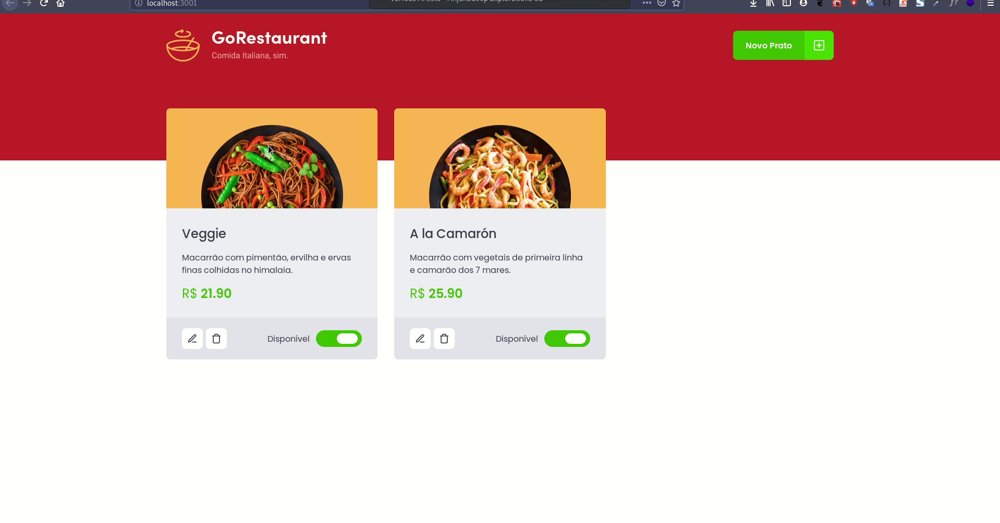

<h1 align="center">
  
<br>
</h1>

<p align="center"> 🚀 GoRestaurant: Aplicação de gerenciamento de conzinha.

<p align="center">
  <a aria-label="Prando" href="https://github.com/gprando/">
    </img>
  </a>
    </img>
    </img>
</p>
<p align="center">
  <a href="https://opensource.org/licenses/MIT">
    
  </a>
</p>

## 🚀 Tecnologias

Tecnologias utilizadas para o desenvolvimento

- [ReactJS](https://reactjs.org/)
- [TypeScript](https://www.typescriptlang.org/)
- [Jest](https://jestjs.io/)
- [SuperTest](https://github.com/visionmedia/supertest)
- [React Router DOM](https://reacttraining.com/react-router/)
- [React Icons](https://react-icons.netlify.com/#/)
- [Styled Components](https://styled-components.com/)
- [Axios](https://github.com/axios/axios)
- [Eslint](https://eslint.org/)
- [Prettier](https://prettier.io/)
- [EditorConfig](https://editorconfig.org/)

## Projeto

GoRestaurant é um projeto controle de comidas para cozinha.

## Getting started

<h1 align="center"></img></h1>

## Instalação - Projeto

### Requisitos

- [Node.js](https://nodejs.org/en/)
- [Yarn](https://classic.yarnpkg.com/) ou [npm](https://www.npmjs.com/)

**Clone o projeto em seu computador.**

```bash
git clone https://github.com/gprando/GoRestaurant
```

## Backend
Para executar o **Servidor** fake execute:

```bash
yarn json-server server.json -p 3333
```

### Frontend
Para iniciar o **Frontend** do React utilize os comandos:
```bash
yarn
yarn start
```
Assim que o processo terminar, automaticamente será aberta no seu navegador a página `localhost:3000` contendo o Projeto.

## 🤔 Como contribuir

Se quiser contribuir para esse repositório aqui, seja corrigindo algum problema, adicionando comentários ou melhorando a documentação, você pode seguir esse tutorial abaixo:

- Faça [um fork](https://help.github.com/pt/github/getting-started-with-github/fork-a-repo) desse repositório;
- Entre no seu perfil no GitHub e faça um clone do repositório que você fez um *fork*;
- Crie uma *branch* com a sua alteração: `git checkout -b minha-alteracao`;
- Faça as alterações necessárias no código ou na documentação;
- Faça *commit* das suas alterações: `git commit -m 'feat: Minha nova feature'`;
- Faça *push* para a sua *branch*: `git push origin minha-alteracao`;
- Agora é só abrir a sua *pull request* no repositório que você fez o *fork*;

Depois que o *merge* da sua *pull request* for feito, você pode deletar a sua *branch*.

## :memo: Licença

Esse projeto é licensiado pela MIT License - Veja a página da [licença](https://opensource.org/licenses/MIT) para detalhes
